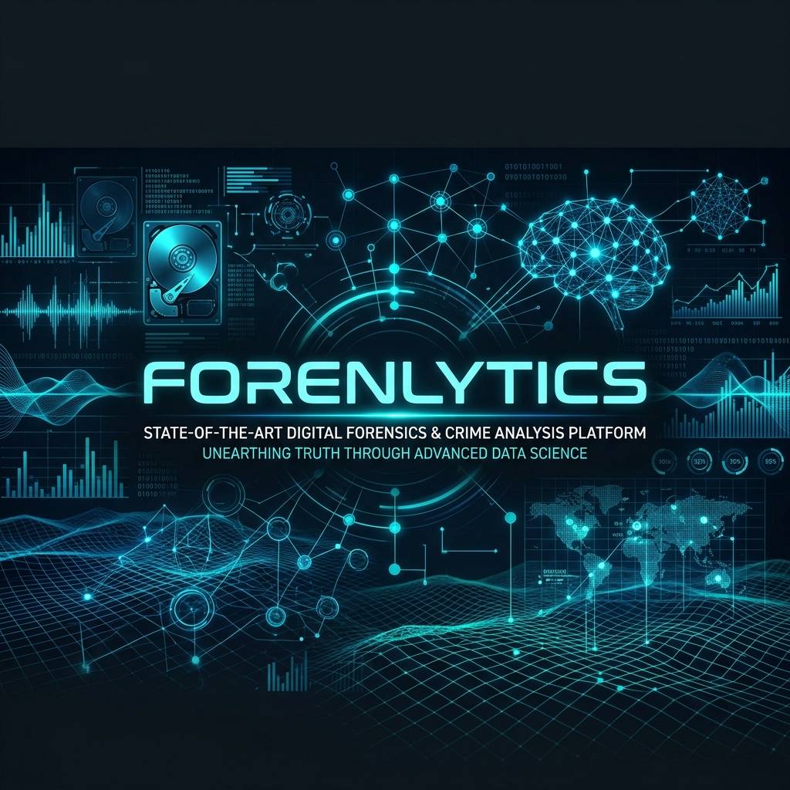
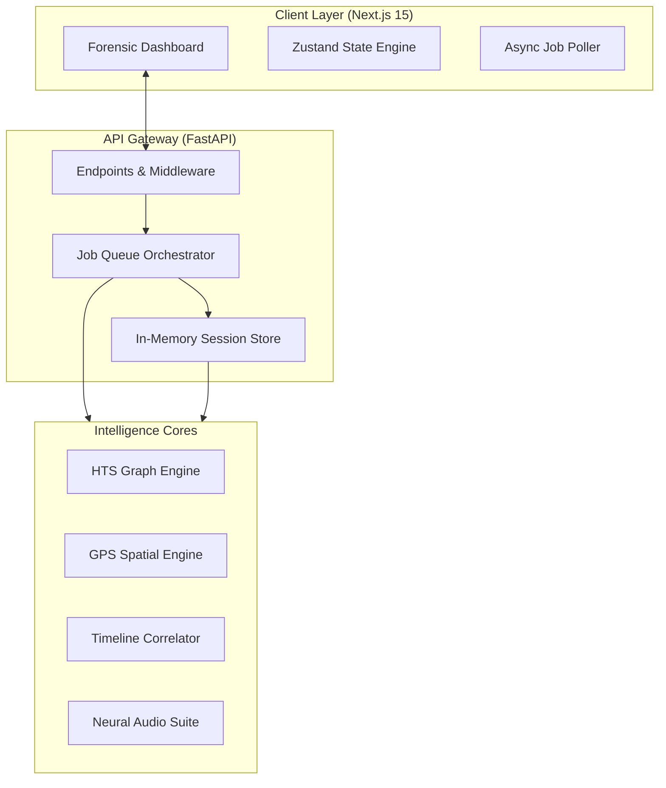

<div align="center">



# 🛡️ Forenlytics
**The Command Center for Signal Intelligence & Geospatial Forensic Reconstruction**

[](https://opensource.org/licenses/MIT)
[](https://nextjs.org/)
[](https://fastapi.tiangolo.com/)
[](https://pytorch.org/)

<p align="center">
  Forenlytics is an elite forensic environment designed for intelligence professionals to ingest raw telecom signaling, geospatial movement logs, and vocal biometric samples—transforming them into high-fidelity investigative intelligence.
</p>

[**Explore Documentation**](#-technical-implementation) • [**Setup Guide**](#-setup--installation) • [**Architecture**](#-system-architecture)

</div>

---

## ✨ Core Intelligence Modules

<table width="100%">
  <tr>
    <td width="50%" valign="top">
      <h4>📊 Signal Intelligence (HTS)</h4>
      <p>Automated graph-based analysis of massive communication matrices. Reconstructs network topologies to identify hubs, bridge-entities, and cluster communities using NetworkX modularity.</p>
    </td>
    <td width="50%" valign="top">
      <h4>📍 Geospatial Reconstruction</h4>
      <p>Transforms raw coordinate sequences into behavioral movement profiles. Heuristically identifies stationary halts and detects velocity anomalies or path inconsistencies.</p>
    </td>
  </tr>
  <tr>
    <td width="50%" valign="top">
      <h4>🕰️ Unified Timeline Orchestrator</h4>
      <p>The master correlator integrating heterogeneous data sources. Correlates signal events with physical location to answer exactly where a target was at any given second.</p>
    </td>
    <td width="50%" valign="top">
      <h4>🎙️ Audio Forensic Suite</h4>
      <p>Neural vocal biometric verification via Microsoft WavLM. Scans for synthetic artifacts, deepfake patterns, and provides high-fidelity similarity scoring.</p>
    </td>
  </tr>
</table>

---

## 🏗️ System Architecture

Forenlytics is built on a state-of-the-art, decoupled architecture designed for high-concurrency data processing.



---

## 🛡️ Privacy & Forensic Integrity

Forenlytics follows **Stateless Ephemeral Processing** principles.

> [!IMPORTANT]
> **Zero Persistence**: All uploaded forensic artifacts and processed results exist only in the volatile memory (RAM) of the server. No databases, no logs, no leaks. Data is automatically purged after 30 minutes of inactivity.

---

## 💻 Technical Implementation

### Key Backend Endpoints

| Method | Endpoint | Forensic Logic |
| :--- | :--- | :--- |
| `POST` | `/upload-hts` | Automated parsing & heuristic column mapping |
| `GET` | `/hts-graph` | Network topology & community metrics |
| `POST` | `/speaker-embedding-compare` | Neural vocal biometric comparison |
| `GET` | `/download-report` | PDF Intelligence stream generation |

### Directory Structure
```text
.
├── src/                    # Frontend: Next.js + Tailwind
│   ├── app/                # Forensic Modules (Audio, GPS, HTS, etc.)
│   ├── components/         # High-fidelity UI Panels & Visualizations
│   └── lib/                # API Engine & Global State
├── backend/                # Backend: FastAPI + ML Cores
│   ├── services/           # The "Brain": Signal & Math Engines
│   └── main.py             # Orchestration & Job Management
└── public/                 # Static Assets & Documentation
```

---

## ⚡ Setup & Installation

### Prerequisites
- Node.js 18+ & Python 3.11+
- FFmpeg (for audio normalization)

### 1. Initializing Backend
```bash
cd backend
python -m venv venv
source venv/bin/activate # Windows: venv\Scripts\activate
pip install -r requirements.txt
uvicorn main:app --port 8000
```

### 2. Initializing Frontend
```bash
# From root
npm install
npm run dev
```

---

## 📜 License & Acknowledgments

- **Copyright**: © 2026 Yusuf Çalışır.
- **License**: Licensed under the [MIT License](LICENSE).
- **Core Engine**: Powered by Microsoft WavLM, NetworkX, and FastAPI.