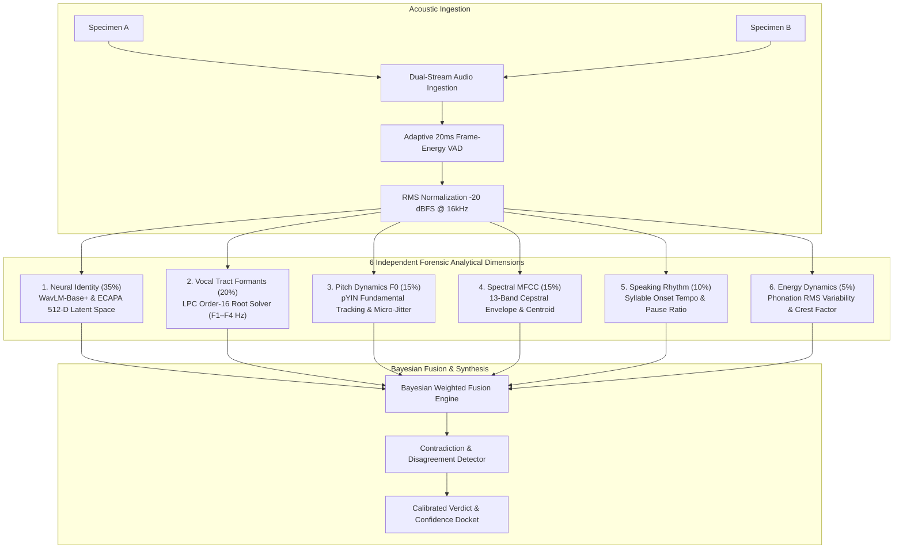
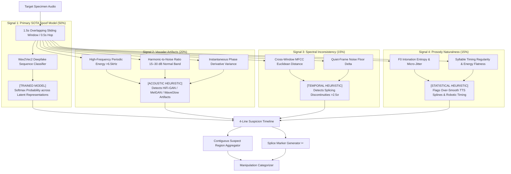
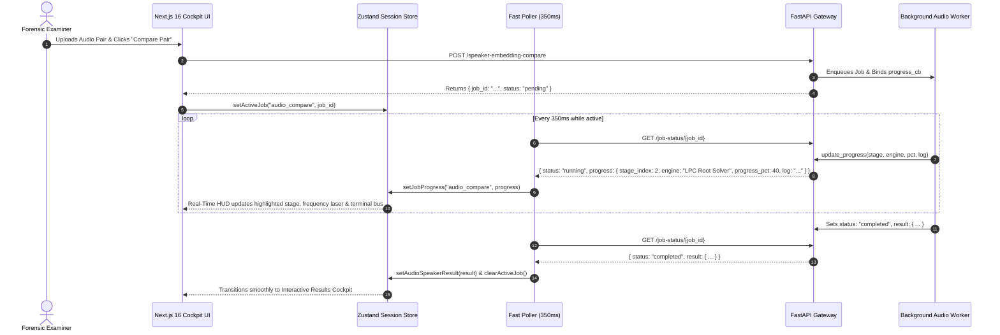

<div align="center">

# 🛡️ FORENLYTICS
### Multi-Dimensional Neural Audio Forensic Intelligence & SOTA Synthetics Diagnostics Platform

[](https://github.com/yusufcalisir/Forenlytics)
[](https://nextjs.org/)
[](https://fastapi.tiangolo.com/)
[](https://pytorch.org/)
[](https://opensource.org/licenses/MIT)

<br />

<p align="center">
  <b>An investigative intelligence platform engineered for judicial, intelligence, and forensic audio examiners.</b><br />
  Combines 6-Dimensional Biometric Acoustic Verification with 4-Signal Sliding-Window Deepfake & Splicing Localization.
</p>

<br />

<a href="https://forenlytics.vercel.app/">
  
</a>

<br /><br />

[⚡ 6D Speaker Verification](#-1-six-dimensional-speaker-verification-matrix) •
[🔍 Deepfake & Splicing Suite](#-2-multi-signal-deepfake--temporal-splicing-suite) •
[⏱️ Sliding Timeline](#-3-sliding-window-temporal-localization) •
[📡 Live Telemetry Bridge](#-4-real-time-live-telemetry-bus) •
[📄 PDF Dockets](#-5-court-ready-pdf-dockets--zero-persistence) •
[🚀 Quickstart](#-quickstart--deployment)

</div>

---

## Executive Summary

Traditional audio comparison systems rely on a single scalar score (e.g. cosine distance of speaker embeddings), while legacy deepfake detectors evaluate whole audio files with static, opaque binary classifiers. Both approaches fail in forensic settings:
1. **Speaker Verification Blind Spots**: Impostors with matching pitch or similar accents fool single-score models, whereas genuine speakers recorded in differing acoustic environments get falsely rejected.
2. **Deepfake Partial Splicing Blind Spots**: Modern speech manipulation injects AI-generated words or clone splices into real speech. Whole-file scans dilute the synthetic signal and produce false negatives, with zero temporal localization.

**Forenlytics resolves both challenges** through a multi-dimensional triangulation architecture:

```
┌──────────────────────────────────────────────────────────────────────────────────────────────────┐
│                               FORENLYTICS DUAL-CORE ENGINE                                       │
├───────────────────────────────────────────────┬──────────────────────────────────────────────────┤
│ 🎙️ 6-DIMENSIONAL SPEAKER VERIFICATION         │ ⚡ MULTI-SIGNAL DEEPFAKE & SPLICING SUITE         │
│ • Neural Identity (WavLM + ECAPA 512-D) [35%] │ • Primary SOTA Classifier (Wav2Vec2) [TRAINED]   │
│ • Vocal Tract Formants (LPC F1–F4)      [20%] │ • Vocoder High-Freq Ripple (>6.5kHz) [ACOUSTIC]  │
│ • Pitch (F0) Dynamics & Micro-Jitter    [15%] │ • Spectral Inconsistency (2.5σ Delta)[TEMPORAL]  │
│ • 13-Band Spectral MFCC & Centroid      [15%] │ • Prosody Naturalness & F0 Entropy   [STATISTIC] │
│ • Speaking Rhythm & Articulation Tempo  [10%] │ • 1.5s Overlapping Sliding Window Timeline       │
│ • Phonation Energy Envelope             [5%]  │ • Millisecond-Accurate Splice Markers (✂)        │
└───────────────────────────────────────────────┴──────────────────────────────────────────────────┘
```

---

## 🎙️ 1. Six-Dimensional Speaker Verification Matrix

Instead of reducing biometric comparison to one opaque number, Forenlytics dissects the vocal tract, neural latent space, and temporal cadence across six independent acoustic dimensions:


```mermaid
graph TD
    subgraph Ingest ["Acoustic Ingestion"]
        A1[Specimen A] & A2[Specimen B] --> DEC[Dual-Stream Audio Ingestion]
        DEC --> VAD[Adaptive 20ms Frame-Energy VAD]
        VAD --> NRM[RMS Normalization -20 dBFS @ 16kHz]
    end

    subgraph DIMS ["6 Independent Forensic Analytical Dimensions"]
        NRM --> D1["1. Neural Identity (35%)<br/>WavLM-Base+ & ECAPA 512-D Latent Space"]
        NRM --> D2["2. Vocal Tract Formants (20%)<br/>LPC Order-16 Root Solver (F1–F4 Hz)"]
        NRM --> D3["3. Pitch Dynamics F0 (15%)<br/>pYIN Fundamental Tracking & Micro-Jitter"]
        NRM --> D4["4. Spectral MFCC (15%)<br/>13-Band Cepstral Envelope & Centroid"]
        NRM --> D5["5. Speaking Rhythm (10%)<br/>Syllable Onset Tempo & Pause Ratio"]
        NRM --> D6["6. Energy Dynamics (5%)<br/>Phonation RMS Variability & Crest Factor"]
    end

    subgraph Synthesis ["Bayesian Fusion & Synthesis"]
        D1 & D2 & D3 & D4 & D5 & D6 --> FUS[Bayesian Weighted Fusion Engine]
        FUS --> CON[Contradiction & Disagreement Detector]
        CON --> VER[Calibrated Verdict & Confidence Docket]
    end
```

### 🔬 Mathematical & Acoustic Foundations

| Dimension | Weight | Primary Engine | Algorithm / Mathematical Basis | Physiological Correlate | Forensic Tolerance |
| :--- | :---: | :--- | :--- | :--- | :--- |
| **1. Neural Identity** | `35%` | `WavLM-Base+ SV` + `ECAPA-TDNN` | $S_{emb} = \frac{\mathbf{u} \cdot \mathbf{v}}{\|\mathbf{u}\|_2 \|\mathbf{v}\|_2} \times 50 + 50$ (512-D) | Deep latent identity representations | Cosine $\ge 0.72$ |
| **2. Vocal Tract LPC** | `20%` | Linear Predictive Coding | Polynomial root solver $A(z) = 1 - \sum_{i=1}^{16} a_i z^{-i} = 0$ | $F_1$ (Pharynx), $F_2$ (Oral), $F_3$ (Tongue), $F_4$ (Larynx) | $\Delta F_{1-4} \le 65\text{ Hz}$ |
| **3. Pitch Dynamics** | `15%` | Probabilistic YIN (`pYIN`) | Fundamental frequency contour correlation $r_{F0}$ & Jitter % | Laryngeal vocal fold mass & tension | $r_{F0} \ge 0.65$, Jitter $< 1.8\%$ |
| **4. Spectral MFCC** | `15%` | 13-Band Mel Cepstrum | DCT of log filterbank energies + Spectral Centroid $\bar{f}_c$ | Overall vocal tract timbre & acoustic cavity shape | $\Delta \text{MFCC} \le 12.0$ |
| **5. Speaking Rhythm** | `10%` | Spectral Flux Onset Detector | Syllable onset rate /s, articulation BPM, speech/pause ratio | Neurological motor control & conversational cadence | $\Delta \text{BPM} \le 18$ |
| **6. Energy Dynamics** | `5%` | RMS Frame Envelope | $\text{Var}(\text{RMS}) + \text{Crest Factor } 20\log_{10}(x_{peak}/x_{rms})$ | Breath support & subglottal pressure modulation | $\Delta \text{Crest} \le 4.5\text{ dB}$ |

### ⚠️ Biometric Contradiction Engine
When dimensions diverge (e.g. neural similarity is high but physical LPC vocal tract length $F_1–F_4$ differs by $>200\text{ Hz}$), Forenlytics flags an **Acoustic Contradiction Alert**, preventing voice clone impostors from spoofing the system.

---

## ⚡ 2. Multi-Signal Deepfake & Temporal Splicing Suite

Rather than depending on a single generic model, Forenlytics evaluates synthetic audio through **four triangulated signals**, distinguishing trained deep neural classifiers from signal-processing heuristics:


```mermaid
graph TD
    IN[Target Specimen Audio] --> SLICE[1.5s Overlapping Sliding Window / 0.5s Hop]

    subgraph S1 ["Signal 1: Primary SOTA Spoof Model (50%)"]
        SLICE --> W2V[Wav2Vec2 Deepfake Sequence Classifier]
        W2V --> S1_OUT["[TRAINED MODEL]<br/>Softmax Probability across Latent Representations"]
    end

    subgraph S2 ["Signal 2: Vocoder Artifacts (20%)"]
        SLICE --> RIPPLE[High-Frequency Periodic Energy >6.5kHz]
        SLICE --> HNR[Harmonic-to-Noise Ratio 15–30 dB Normal Band]
        SLICE --> PHASE[Instantaneous Phase Derivative Variance]
        RIPPLE & HNR & PHASE --> S2_OUT["[ACOUSTIC HEURISTIC]<br/>Detects HiFi-GAN / MelGAN / WaveGlow Artifacts"]
    end

    subgraph S3 ["Signal 3: Spectral Inconsistency (15%)"]
        SLICE --> DELTA[Cross-Window MFCC Euclidean Distance]
        SLICE --> NOISE[Quiet-Frame Noise Floor Delta]
        DELTA & NOISE --> S3_OUT["[TEMPORAL HEURISTIC]<br/>Detects Splicing Discontinuities >2.5σ"]
    end

    subgraph S4 ["Signal 4: Prosody Naturalness (15%)"]
        SLICE --> ENTROPY[F0 Intonation Entropy & Micro-Jitter]
        SLICE --> RHYTHM[Syllable Timing Regularity & Energy Flatness]
        ENTROPY & RHYTHM --> S4_OUT["[STATISTICAL HEURISTIC]<br/>Flags Over-Smooth TTS Splines & Robotic Timing"]
    end

    S1_OUT & S2_OUT & S3_OUT & S4_OUT --> TIMELINE[4-Line Suspicion Timeline]
    TIMELINE --> INTERVALS[Contiguous Suspect Region Aggregator]
    TIMELINE --> BOUNDARIES[Splice Marker Generator ✂]
    INTERVALS & BOUNDARIES --> CATEGORY[Manipulation Categorizer]
```

### 🔍 Diagnostic Indicators Detailed

```
[Signal 1: Primary Model]      [Signal 2: Vocoder Artifacts]   [Signal 3: Spectral Splicing]   [Signal 4: Prosody Naturalness]
Type: TRAINED MODEL            Type: ACOUSTIC HEURISTIC        Type: TEMPORAL HEURISTIC        Type: STATISTICAL HEURISTIC
Weight: 50%                    Weight: 20%                     Weight: 15%                     Weight: 15%
Target: Latent spoof tokens    Target: GAN Vocoder ripple      Target: Splice boundary jumps   Target: Robotic / Over-smooth
Model: Wav2Vec2 Classifier     Band: Freq > 6,500 Hz           Metric: Cross-Window ΔMFCC      Metric: F0 Pitch Entropy & Jitter
Sub-checks: Sequence Softmax   Sub-checks: HNR + Phase Var     Sub-checks: 2.5σ Threshold      Sub-checks: Onset CoV + RMS Flatness
```

---

## ⏱️ 3. Sliding-Window Temporal Localization

Forenlytics breaks audio into **1.5s sliding windows with 0.5s hops**. Every window computes all three independent indicators plus the composite score, generating an interactive **4-Line Suspicion Timeline**:

```
 100% ┌─────────────────────────────────────────────────────────────┐
      │                      ▲                                      │
  70% ┼─────────────────────/─\───────SUSPICIOUS REGION─────────────┼ >65% High Risk
      │  Vocoder (Amber)   /   \                                    │
  50% ┼───────────────────/─────\───────────────────────────────────┼
      │                  /   ✂   \  Spectral Jump (Emerald)         │
  35% ┼─Organic (Purple)───────────\────────────────────────────────┼ <35% Organic
      │                             \_______________________________│
   0% └──────┬──────────────┬──────────────┬──────────────┬─────────┘
            0.0s           1.5s           3.0s           4.5s      Time (s)
                           └─── Suspect Interval: 1.5s–3.0s ───┘
```

### ✂ Splice Boundary Markers
When the cross-window MFCC delta or background noise floor shifts beyond **$2.5\sigma$ of the file's own global baseline**, Forenlytics generates a vertical green dashed **Splice Marker (✂)** at the exact second of manipulation.

### 🏷️ Manipulation Categories
- **`FULLY_SYNTHETIC`** ($\ge 70\%$ anomaly score or $\ge 70\%$ flagged windows): Audio is entirely generated by TTS or voice clone models.
- **`SPLICED_PARTIAL`** ($\ge 38\%$ score with contiguous suspect intervals): Natural human speech with localized synthetic insertions or audio cuts.
- **`LIKELY_AUTHENTIC`** ($< 38\%$ score): Unmanipulated human speech with natural organic micro-jitter and spectral continuity.

---

## 📡 4. Real-Time Live Telemetry Bus

Forenlytics features a **sub-400ms bidirectional telemetry bridge** connecting FastAPI background worker threads with the Next.js cockpit UI:


```mermaid
sequenceDiagram
    autonumber
    actor Examiner as Forensic Examiner
    participant UI as Next.js 16 Cockpit UI
    participant Store as Zustand Session Store
    participant Poller as Fast Poller (350ms)
    participant API as FastAPI Gateway
    participant Worker as Background Audio Worker

    Examiner->>UI: Uploads Audio Pair & Clicks "Compare Pair"
    UI->>API: POST /speaker-embedding-compare
    API->>Worker: Enqueues Job & Binds progress_cb
    API-->>UI: Returns { job_id: "...", status: "pending" }
    UI->>Store: setActiveJob("audio_compare", job_id)
    
    loop Every 350ms while active
        Poller->>API: GET /job-status/{job_id}
        Worker->>API: update_progress(stage, engine, pct, log)
        API-->>Poller: { status: "running", progress: { stage_index: 2, engine: "LPC Root Solver", progress_pct: 40, log: "..." } }
        Poller->>Store: setJobProgress("audio_compare", progress)
        Store-->>UI: Real-Time HUD updates highlighted stage, frequency laser & terminal bus
    end

    Worker->>API: Sets status: "completed", result: { ... }
    Poller->>API: GET /job-status/{job_id}
    API-->>Poller: { status: "completed", result: { ... } }
    Poller->>Store: setAudioSpeakerResult(result) & clearActiveJob()
    Store-->>UI: Transitions smoothly to Interactive Results Cockpit
```

---

## 📄 5. Court-Ready PDF Dockets & Zero-Persistence

Forenlytics compiles official, court-ready **Forensic Audio Intelligence Dockets** in-memory:

```
┌─────────────────────────────────────────────────────────────────────────────┐
│ FORENLYTICS AUDIO FORENSIC INTELLIGENCE DOCKET      DOCKET REF: FLX-7F3A92BC│
│ OFFICIAL MULTI-SIGNAL NEURAL BIOMETRIC & SYNTHETICS RECORD      UTC 2026-08 │
├─────────────────────────────────────────────────────────────────────────────┤
│ 1.0 EXAMINATION METADATA & CHAIN OF CUSTODY                                 │
│ • Suite: Forenlytics Neural Audio v2.0  • Ingestion: 16kHz Mono PCM, -20dBFS│
│ • Target Sample SHA-256: e3b0c44298fc1c149afbf4c8996fb92427ae41e4...       │
│ • Comparison Sample SHA-256: ca978112ca1bbdcaf064278e4a1f2f0dda12...       │
│                                                                             │
│ 2.0 SIX-DIMENSIONAL SPEAKER VERIFICATION MATRIX                             │
│ ┌───────────────────────────┬────────┬───────┬────────────────────────────┐ │
│ │ Dimension                 │ Weight │ Score │ Physiological Finding      │ │
│ ├───────────────────────────┼────────┼───────┼────────────────────────────┤ │
│ │ 1. Neural Identity        │  35%   │ 88.0% │ WavLM & ECAPA Cosine Match │ │
│ │ 2. Vocal Tract Formants   │  20%   │ 82.5% │ F1-F4 LPC Resonances Align │ │
│ │ 3. Pitch Intonation F0    │  15%   │ 86.0% │ pYIN Micro-Jitter 1.1%     │ │
│ │ 4. Spectral MFCC          │  15%   │ 81.0% │ 13-Band Centroid Match     │ │
│ │ 5. Speaking Rhythm        │  10%   │ 79.5% │ Onset Cadence 4.2/s        │ │
│ │ 6. Energy Dynamics        │   5%   │ 90.0% │ Phonation RMS Variation    │ │
│ └───────────────────────────┴────────┴───────┴────────────────────────────┘ │
│ COMPOSITE BIOMETRIC MATCH: 84.5%  •  VERDICT: Very Likely Same Speaker [HIGH]│
│                                                                             │
│ 3.0 MULTI-SIGNAL DEEPFAKE & TEMPORAL SPLICING DIAGNOSTICS                   │
│ • Primary Model: 86.0%  • Vocoder Ripple: 91.5%  • Prosody Entropy: 78.0%  │
│ • Splice Boundaries (✂): 1.50s, 3.00s  • Suspect Range: [1.5s – 3.0s]      │
│ • Manipulation Category: Partial Splicing / Localized Synthetic Injection   │
│                                                                             │
│ 4.0 EXPERT FORENSIC OPINION & STATUTORY DISCLAIMER                          │
└─────────────────────────────────────────────────────────────────────────────┘
```

### 🔒 Zero-Persistence Security Architecture
- **Volatile RAM Processing**: Audio bytes, spectrograms, and embedding matrices exist exclusively in ephemeral server memory.
- **No Disk Persistence**: Files are never written to permanent storage; all temp buffers are garbage collected after execution.
- **Automatic Purge**: Inactive session records and job tokens are securely purged every 30 minutes.

---

## 💻 Technical Architecture & Endpoints

### 🌐 System Endpoints

| Method | Endpoint | Formats | Functionality |
| :--- | :--- | :--- | :--- |
| `GET` | `/health` | — | System health status, volatile memory usage & active worker count |
| `POST` | `/session` | — | Explicit session initialization and UUID token allocation |
| `POST` | `/speaker-embedding-compare` | `.wav`, `.mp3`, `.flac`, `.ogg`, `.m4a` | Enqueues 6D multi-dimensional neural speaker verification job |
| `POST` | `/deepfake-detect` | `.wav`, `.mp3`, `.flac`, `.ogg`, `.m4a` | Enqueues multi-signal deepfake & sliding-window splicing scan |
| `GET` | `/job-status/{job_id}` | — | Returns live job status, active stage index, engine name & telemetry log |
| `GET` | `/generate-report` | — | Compiles structured JSON summary of session forensic findings |
| `GET` | `/download-report` | — | Generates and streams official PDF Audio Forensic Docket in-memory |
| `POST` | `/cleanup` | — | Forces immediate garbage collection, cache wipe, and session cleanup |

### 📂 Repository Structure

```text
d:/Forenlytics/
├── backend/                               # FastAPI High-Throughput Engine
│   ├── main.py                            # API routing, CORS, job queue & endpoints
│   ├── services/
│   │   ├── job_manager.py                 # Thread-safe async job queue & live progress tracker
│   │   ├── session_store.py               # In-memory ephemeral session manager
│   │   ├── report_generator.py            # Zero-overflow ReportLab PDF docket compiler
│   │   └── audio/                         # Forensic Analytical Cores
│   │       ├── facade.py                  # Master orchestrator & progress dispatcher
│   │       ├── preprocessor.py            # Audio decoding, mono downmix & 20ms VAD
│   │       ├── engine_embedding.py        # WavLM-Base+ SV & ECAPA-TDNN extractors
│   │       ├── engine_formants.py         # LPC Order-16 F1-F4 vocal tract solver
│   │       ├── engine_pitch.py            # pYIN fundamental frequency & jitter extractor
│   │       ├── engine_rhythm.py           # Syllable onset detector & tempo analyzer
│   │       ├── engine_biometric.py        # 13-Band MFCC & spectral centroid extractor
│   │       ├── engine_deepfake.py         # SOTA Wav2Vec2 + 3-Indicator sliding window
│   │       └── fusion_engine.py           # Bayesian multi-dimensional fusion & contradiction
│   └── requirements.txt                   # Backend Python dependencies
│
├── frontend/                              # Next.js 16 (Turbopack) Cockpit
│   ├── src/
│   │   ├── app/                           # App Router
│   │   │   ├── page.tsx                   # Studio landing & feature index
│   │   │   ├── audio/page.tsx             # Integrated Forensic Intelligence Cockpit
│   │   │   └── reports/page.tsx           # Interactive Docket Viewer & PDF Exporter
│   │   ├── components/
│   │   │   ├── audio/                     # Interactive Forensic Visualizers
│   │   │   │   ├── PipelinePreFlight.tsx  # Pre-Flight Architecture Blueprints
│   │   │   │   ├── PipelineLiveScanner.tsx# Real-Time Telemetry Scanner HUD
│   │   │   │   ├── SuspicionTimeline.tsx  # 4-Line Suspicion Timeline & Splice Markers
│   │   │   │   ├── RadarChart.tsx         # 6-Axis Biometric Radar Visualizer
│   │   │   │   ├── PitchContourChart.tsx  # pYIN F0 Intonation Contour Overlays
│   │   │   │   ├── MfccBarChart.tsx       # 13-Band MFCC Delta Comparison
│   │   │   │   └── TelemetryTable.tsx     # Low-level acoustic parameter matrix
│   │   │   └── layout/
│   │   │       ├── JobPoller.tsx          # Fast 350ms background sync poller
│   │   │       └── AppLayout.tsx          # Global navigation & status indicators
│   │   └── lib/
│   │       ├── store.ts                   # Zustand persistent session store & jobProgress
│   │       └── apiClient.ts               # Proxy-aware Fetch API client
│   ├── package.json                       # Next.js dependencies
│   └── next.config.ts                     # Turbopack config & API proxy rewrites
└── README.md                              # Master forensic documentation
```

---

## 🚀 Quickstart & Deployment

### Prerequisites
- **Python 3.10+** (with PyTorch, Torchaudio & Librosa)
- **Node.js 18+** & **npm**

### 1. Start the Backend API
```bash
cd backend
python -m venv venv

# Windows PowerShell
.\venv\Scripts\activate
# Linux / macOS
source venv/bin/activate

pip install -r requirements.txt
uvicorn main:app --host 127.0.0.1 --port 8000 --reload
```

### 2. Start the Frontend Studio
```bash
cd frontend
npm install
npm run dev
```

Open [http://localhost:3000](http://localhost:3000) in your browser to enter the **Audio Forensics Intelligence Studio**.

---

## 📜 License & Forensic Attribution

- **Lead Architect & Developer**: Yusuf Çalışır ([github.com/yusufcalisir](https://github.com/yusufcalisir))
- **License**: Released under the [MIT License](LICENSE).
- **Core Open-Source Intelligence**: Powered by Microsoft WavLM, SpeechBrain ECAPA-TDNN, Hugging Face Transformers (`garystafford/wav2vec2-deepfake-voice-detector`), Librosa, PyTorch, FastAPI, Next.js 16 (Turbopack), TailwindCSS, Recharts, and ReportLab.