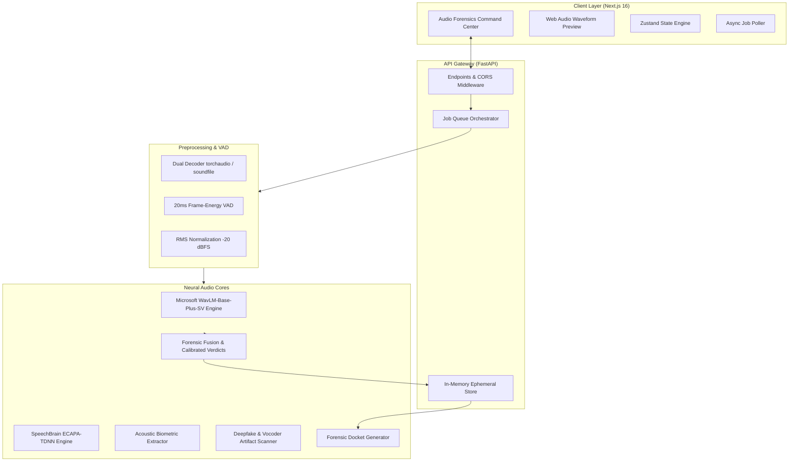

# 🛡️ Forenlytics
### High-Fidelity Neural Audio Forensic Intelligence & Synthetics Analysis Platform

[](https://opensource.org/licenses/MIT)
[](https://nextjs.org/)
[](https://fastapi.tiangolo.com/)
[](https://pytorch.org/)

<br />

<div align="center">
  <a href="https://forenlytics.vercel.app/">
    
  </a>
</div>

<br />

Forenlytics is an elite audio forensics environment designed for intelligence and legal professionals to ingest acoustic specimens and vocal samples, transforming them into high-fidelity investigative intelligence through neural biometric verification, Voice Activity Detection (VAD), and synthetic anomaly detection.

---

## ✨ Core Intelligence Modules

<table width="100%">
  <tr>
    <td width="50%" valign="top">
      <h4>🎙️ Neural Speaker Verification</h4>
      <p>Dual-stream biometric comparison using <b>Microsoft WavLM-Base-Plus-SV</b> (with windowed mean-pooling for long audio) and <b>SpeechBrain ECAPA-TDNN</b> (with Wav2Vec2 fallback). Computes L2-normalized cosine similarity across deep speaker representations.</p>
    </td>
    <td width="50%" valign="top">
      <h4>🧬 Physiological Vocal Biometrics</h4>
      <p>Extracts fundamental frequency (F0 YIN algorithm), formant bandwidth ratios, MFCCs, shimmer, jitter, and spectral harmonic distributions for non-invasive vocal tract profiling.</p>
    </td>
  </tr>
  <tr>
    <td width="50%" valign="top">
      <h4>⚡ Synthetic Vocoder & Deepfake Scan</h4>
      <p>Detects AI voice synthesis and deepfakes by identifying temporal embedding over-smoothing, zero-crossing rate anomalies, onset dynamics, and high-frequency spectral roll-off distortions.</p>
    </td>
    <td width="50%" valign="top">
      <h4>📄 Court-Ready Forensic PDF Dockets</h4>
      <p>Instantly compiles and exports structured forensic dockets with SHA-256 file hashes, post-VAD speech durations, mathematical similarity scores, biometric radar breakdowns, diagnostic opinions, and verifiable session telemetry.</p>
    </td>
  </tr>
</table>

---

## 🎚️ Forensic Preprocessing & VAD Pipeline

Before extracting neural embeddings, all uploaded specimens pass through a hardened preprocessing pipeline:
1. **Multi-Format Dual Decoding**: Ingests `.wav`, `.mp3`, `.flac`, `.ogg`, and `.m4a` via `torchaudio` with graceful fallback to `soundfile`.
2. **Resampling & Downmixing**: Downmixes to mono and resamples to standard 16 kHz PCM.
3. **20ms Frame-Energy VAD**: Strips leading, trailing, and mid-utterance silence/noise floors to ensure embeddings are computed strictly on active speech.
4. **RMS Loudness Normalization**: Targets -20 dBFS RMS to prevent volume disparities from biasing similarity scores.
5. **Speech Duration Gate**: Enforces a minimum of 1.5s active speech, rejecting corrupt or near-silent files with descriptive error messages.

---

## 📊 Calibrated Verdicts & Confidence Bands

Forenlytics calibrates composite similarity scores against heuristic forensic thresholds:

| Composite Similarity | Forensic Verdict | Confidence Band | Recommended Action |
| :--- | :--- | :--- | :--- |
| **≥ 80.0%** | `Very Likely Same Speaker` | **HIGH** | Strong acoustic correlation across WavLM and biometric channels. |
| **≥ 65.0%** | `Likely Same Speaker` | **HIGH / MEDIUM** | Probable match; consistent vocal tract and harmonic profile. |
| **≥ 45.0%** | `Inconclusive` | **MEDIUM / LOW** | Mixed evidence or cross-channel acoustic degradation. |
| **≥ 30.0%** | `Likely Different Speaker` | **MEDIUM** | Divergent vocal tract geometry and neural embeddings. |
| **< 30.0%** | `Very Likely Different Speaker` | **HIGH** | Distinct speaker identities with conflicting biometric markers. |

---

## 🏗️ System Architecture

Forenlytics is built on a high-throughput, decoupled architecture designed for neural audio model execution and ephemeral session management.


```mermaid
graph TD
    subgraph Client ["Client Layer (Next.js 16)"]
        UI[Audio Forensics Command Center]
        Wave[Web Audio Waveform Preview]
        Store[Zustand State Engine]
        Poll[Async Job Poller]
    end

    subgraph API ["API Gateway (FastAPI)"]
        Router[Endpoints & CORS Middleware]
        Manager[Job Queue Orchestrator]
        Session[In-Memory Ephemeral Store]
    end

    subgraph Preproc ["Preprocessing & VAD"]
        DEC[Dual Decoder torchaudio / soundfile]
        VAD[20ms Frame-Energy VAD]
        NRM[RMS Normalization -20 dBFS]
    end

    subgraph Cores ["Neural Audio Cores"]
        WLM[Microsoft WavLM-Base-Plus-SV Engine]
        ECP[SpeechBrain ECAPA-TDNN Engine]
        BIO[Acoustic Biometric Extractor]
        DFK[Deepfake & Vocoder Artifact Scanner]
        FUS[Forensic Fusion & Calibrated Verdicts]
        RPT[Forensic Docket Generator]
    end

    UI <--> Router
    Router --> Manager
    Manager --> Preproc
    Preproc --> Cores
    Cores --> FUS
    FUS --> Session
    Session --> RPT
```

---

## 🛡️ Privacy & Forensic Integrity

Forenlytics follows strict **Stateless Ephemeral Processing** principles.

> [!IMPORTANT]
> **Zero Persistence**: All uploaded audio specimens and biometric matrices exist solely in volatile server RAM. No audio files or embeddings are permanently stored on disk or in persistent databases. Sessions are automatically purged after 30 minutes of inactivity. SHA-256 cryptographic hashes are computed in-memory to maintain chain of custody on generated dockets.

---

## 💻 Technical Implementation

### Backend Endpoints

| Method | Endpoint | Supported Formats | Forensic Logic |
| :--- | :--- | :--- | :--- |
| `GET` | `/health` | — | Real-time health, active sessions & operational telemetry |
| `POST` | `/session` | — | Ephemeral session initialization & UUID allocation |
| `POST` | `/speaker-embedding-compare` | `.wav`, `.mp3`, `.flac`, `.ogg`, `.m4a` | Dual-stream WavLM-SV & biometric voice similarity analysis |
| `POST` | `/deepfake-detect` | `.wav`, `.mp3`, `.flac`, `.ogg`, `.m4a` | Synthetic vocoder artifact & deepfake probability scan |
| `GET` | `/job-status/{job_id}` | — | Async polling for long-running neural audio workloads |
| `GET` | `/generate-report` | — | Structured JSON summary of session forensic findings |
| `GET` | `/download-report` | — | Official PDF Audio Forensic Docket stream generation |
| `POST` | `/cleanup` | — | Force purge of volatile memory, jobs, and temporary caches |

### Directory Structure
```text
.
├── frontend/               # Next.js 16 Application
│   ├── src/
│   │   ├── app/            # App Router (Dashboard, Audio, Reports)
│   │   ├── components/     # UI & Audio Forensics Modules (Dropzones, Gauges, Waveforms)
│   │   └── lib/            # Zustand Store & API Client
│   └── public/             # Static Assets
├── backend/                # FastAPI Application
│   ├── services/           # Neural Audio, Biometric & Report Engines
│   │   └── audio/          # WavLM, SpeechBrain ECAPA, Biometrics & Deepfake
│   └── main.py             # API Routing & Job Management
├── vercel.json             # Multi-service Deployment Configuration
└── LICENSE                 # MIT License
```

---

## ⚡ Setup & Installation

### 1. Initializing Backend
```bash
cd backend
python -m venv venv
source venv/bin/activate # Windows: venv\Scripts\activate
pip install -r requirements.txt
uvicorn main:app --port 8000
```

### 2. Initializing Frontend
```bash
cd frontend
npm install
npm run dev
```

---

## 📜 License & Acknowledgments

- **Copyright**: © 2026 Yusuf Çalışır.
- **License**: Licensed under the [MIT License](LICENSE).
- **Core Engine**: Powered by Microsoft WavLM, SpeechBrain, PyTorch, Librosa, and FastAPI.