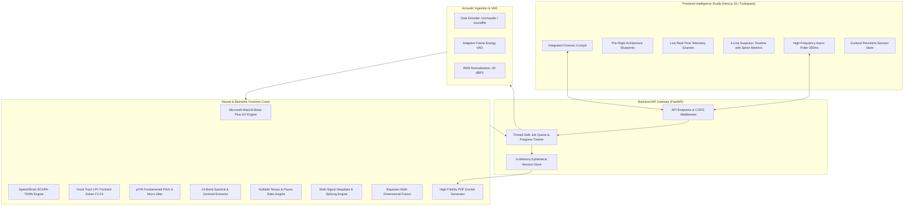

# 🛡️ Forenlytics
### Multi-Dimensional Neural Audio Forensic Intelligence & Synthetic Speech Diagnostics Platform

[](https://opensource.org/licenses/MIT)
[](https://nextjs.org/)
[](https://fastapi.tiangolo.com/)
[](https://pytorch.org/)

<br />

<div align="center">
  <a href="https://forenlytics.vercel.app/">
    
  </a>
</div>

<br />

**Forenlytics** is an advanced, production-ready audio forensic intelligence suite built for investigators, forensic examiners, and intelligence analysts. It transforms raw acoustic audio specimens into high-fidelity evidence through **6-Dimensional Neural Biometric Speaker Verification**, **Multi-Signal SOTA Deepfake Voice Detection**, and **Sliding-Window Temporal Splicing Localization**.

---

## ⚡ Core Forensic Pillars

<table width="100%">
  <tr>
    <td width="50%" valign="top">
      <h3>🎙️ 1. 6-Dimensional Speaker Verification</h3>
      <p>Moves beyond single-number similarity scores by computing six independent biometric and physiological acoustic dimensions:</p>
      <ul>
        <li><b>Neural Identity (35%)</b>: Microsoft WavLM-Base-Plus-SV & SpeechBrain ECAPA-TDNN 512-D cosine space projection.</li>
        <li><b>Vocal Tract Formants (20%)</b>: LPC order-16 root solving for F1–F4 anatomical resonances & vocal tract length (VTL) dispersion.</li>
        <li><b>Pitch Dynamics (15%)</b>: pYIN probabilistic fundamental frequency ($F_0$) intonation tracking and micro-jitter flutter (%).</li>
        <li><b>Spectral MFCC Fingerprint (15%)</b>: 13-band Mel-frequency cepstral vectors, spectral centroid, and crest factor dynamics.</li>
        <li><b>Speaking Rhythm (10%)</b>: Syllable onset rate, articulation tempo (BPM), and speech-to-pause ratio.</li>
        <li><b>Energy Dynamics (5%)</b>: RMS energy modulation across phonation frames.</li>
      </ul>
    </td>
    <td width="50%" valign="top">
      <h3>⚡ 2. Multi-Signal Deepfake & Splicing Suite</h3>
      <p>Combines fine-tuned sequence classification models with signal-processing acoustic heuristics for comprehensive synthetic speech detection:</p>
      <ul>
        <li><b>Signal 1: Primary SOTA Spoof Model</b>: Fine-tuned Wav2Vec2 sequence classifier (<code>garystafford/wav2vec2-deepfake-voice-detector</code>) [TRAINED MODEL].</li>
        <li><b>Signal 2: Vocoder Artifacts</b>: Scans for GAN vocoder transposition ripple ($>6.5\text{ kHz}$), HNR normal range, and phase coherence variance [ACOUSTIC HEURISTIC].</li>
        <li><b>Signal 3: Spectral Inconsistency</b>: Cross-window MFCC jumps ($>2.5\sigma$ threshold) and room-tone noise floor deltas [TEMPORAL HEURISTIC].</li>
        <li><b>Signal 4: Prosody Naturalness</b>: Pitch ($F_0$) entropy, micro-inflection jitter, and metronomic syllable cadence regularity [STATISTICAL HEURISTIC].</li>
      </ul>
    </td>
  </tr>
  <tr>
    <td width="50%" valign="top">
      <h3>⏱️ 3. Sliding-Window Temporal Localization</h3>
      <p>Splits audio into overlapping <b>1.5s sliding windows (0.5s hop)</b>, computing all indicators per window to pinpoint exact timestamps of partial deepfake injections and mark acoustic splice boundaries (✂).</p>
      <ul>
        <li><b>4-Line Suspicion Timeline</b>: Interactive multi-series visualization (Vocoder, Spectral, Prosody, Combined).</li>
        <li><b>Splice Boundary Markers</b>: Vertical markers at abrupt recording environment shifts.</li>
        <li><b>Contiguous Suspect Regions</b>: Highlights localized injected intervals (e.g. <code>1.5s – 3.0s</code>).</li>
      </ul>
    </td>
    <td width="50%" valign="top">
      <h3>📄 4. Court-Ready Forensic PDF Dockets</h3>
      <p>Generates structured, zero-overflow PDF intelligence dockets in volatile RAM:</p>
      <ul>
        <li><b>Cryptographic Chain of Custody</b>: In-memory SHA-256 specimen hashing, exact sample rates, and voiced duration metadata.</li>
        <li><b>Section-by-Section Forensic Breakdown</b>: 6D biometric matrix, 4-signal deepfake matrix, and localized timestamp tables.</li>
        <li><b>Contradiction & Disagreement Alerts</b>: Clear flags when physiological markers diverge from neural embeddings.</li>
        <li><b>Methodological Transparency</b>: Explicit delineation between trained neural models and acoustic signal heuristics.</li>
      </ul>
    </td>
  </tr>
</table>

---

## 🎚️ Forensic Ingestion & Preprocessing Pipeline

Before executing neural models, all specimens pass through a hardened acoustic preprocessing pipeline:
1. **Multi-Format Dual Decoding**: Ingests `.wav`, `.mp3`, `.flac`, `.ogg`, and `.m4a` via `torchaudio` with graceful fallback to `soundfile`.
2. **Resampling & Channel Normalization**: Downmixes multi-channel audio to mono and resamples to standard 16,000 Hz PCM.
3. **Adaptive 20ms Frame-Energy VAD**: Strips silence and background noise floors so extraction occurs strictly on voiced speech phonation.
4. **RMS Loudness Calibration**: Targets -20 dBFS RMS to eliminate recording volume disparities from biasing biometric similarities.
5. **Speech Duration Validation**: Enforces minimum voiced speech duration ($>1.5\text{s}$), rejecting near-silent recordings with actionable diagnostics.

---

## 📊 Calibrated Decision Thresholds

### Speaker Verification Thresholds
| Composite Similarity | Verdict | Confidence | Analytical Profile |
| :--- | :--- | :--- | :--- |
| **≥ 80.0%** | `Very Likely Same Speaker` | **HIGH** | Strong congruence across WavLM, LPC formants, F0 intonation, and MFCC vectors. |
| **≥ 65.0%** | `Likely Same Speaker` | **MEDIUM / HIGH** | Probable match; consistent vocal tract resonance and fundamental frequency range. |
| **≥ 45.0%** | `Inconclusive` | **MEDIUM / LOW** | Contradictory markers (e.g. similar pitch but divergent vocal tract anatomy). |
| **≥ 30.0%** | `Likely Different Speaker` | **MEDIUM** | Divergent vocal tract geometry, distinct pitch registers, and low embedding cosine. |
| **< 30.0%** | `Very Likely Different Speaker` | **HIGH** | Confirmed distinct speaker identities across all physiological and neural channels. |

### Deepfake Manipulation Categorization
| Anomaly Index / Condition | Category | Category Label | Forensic Implication |
| :--- | :--- | :--- | :--- |
| **≥ 70%** (or $\ge 70\%$ flagged windows) | `FULLY_SYNTHETIC` | Entirely Synthetic / AI-Generated Speech | Full TTS / voice clone generation across the entire timeline. |
| **≥ 38%** (with localized suspect intervals) | `SPLICED_PARTIAL` | Partial Splicing / Localized Synthetic Injection | Authentic speech with selective deepfake audio injection or splice edit points. |
| **< 38%** | `LIKELY_AUTHENTIC` | Likely Authentic Human Speech | Natural vocal phonation, organic micro-jitter, and consistent spectral envelope. |

---

## 🏗️ System Architecture


```mermaid
graph TD
    subgraph Client ["Frontend Intelligence Studio (Next.js 16 / Turbopack)"]
        Cockpit[Integrated Forensic Cockpit]
        PreFlight[Pre-Flight Architecture Blueprints]
        Scanner[Live Real-Time Telemetry Scanner]
        Timeline[4-Line Suspicion Timeline with Splice Markers]
        Poller[High-Frequency Async Poller 350ms]
        Store[Zustand Persistent Session Store]
    end

    subgraph API ["Backend API Gateway (FastAPI)"]
        Router[API Endpoints & CORS Middleware]
        JobMgr[Thread-Safe Job Queue & Progress Tracker]
        SessionStore[In-Memory Ephemeral Session Store]
    end

    subgraph Preproc ["Acoustic Ingestion & VAD"]
        DEC[Dual Decoder: torchaudio / soundfile]
        VAD[Adaptive Frame-Energy VAD]
        NRM[RMS Normalization -20 dBFS]
    end

    subgraph Cores ["Neural & Biometric Forensic Cores"]
        WLM[Microsoft WavLM-Base-Plus-SV Engine]
        ECP[SpeechBrain ECAPA-TDNN Engine]
        LPC[Vocal Tract LPC Formant Solver F1-F4]
        F0[pYIN Fundamental Pitch & Micro-Jitter]
        MFCC[13-Band Spectral & Centroid Extractor]
        RHY[Syllable Tempo & Pause Ratio Engine]
        DFK[Multi-Signal Deepfake & Splicing Engine]
        FUS[Bayesian Multi-Dimensional Fusion]
        RPT[High-Fidelity PDF Docket Generator]
    end

    Cockpit <--> Router
    Poller <--> Router
    Router --> JobMgr
    JobMgr --> Preproc
    Preproc --> Cores
    Cores --> JobMgr
    JobMgr --> SessionStore
    SessionStore --> RPT
```

---

## 🔒 Ephemeral Zero-Persistence Privacy Model

Forenlytics is engineered for sensitive, non-destructive forensic examinations:
- **Zero Storage Footprint**: Uploaded audio specimens, extracted feature matrices, and embeddings reside solely in volatile RAM.
- **Auto-Purge**: Inactive forensic sessions and temporary memory buffers are automatically wiped after 30 minutes of inactivity.
- **Cryptographic Hashes**: In-memory SHA-256 digests are computed upon ingestion to maintain forensic chain-of-custody without writing files to persistent storage.

---

## 💻 API Reference

| Method | Endpoint | Formats | Description |
| :--- | :--- | :--- | :--- |
| `GET` | `/health` | — | System health status, active session counts, and operational telemetry. |
| `POST` | `/session` | — | Explicit session initialization and UUID token generation. |
| `POST` | `/speaker-embedding-compare` | `.wav`, `.mp3`, `.flac`, `.ogg`, `.m4a` | Enqueues 6D neural biometric speaker verification job. |
| `POST` | `/deepfake-detect` | `.wav`, `.mp3`, `.flac`, `.ogg`, `.m4a` | Enqueues multi-signal deepfake and temporal splicing scan job. |
| `GET` | `/job-status/{job_id}` | — | Returns async job status, live stage index, engine name, progress %, and telemetry log. |
| `GET` | `/generate-report` | — | Returns structured JSON summary of session forensic findings. |
| `GET` | `/download-report` | — | Generates and streams official PDF Audio Forensic Docket in-memory. |
| `POST` | `/cleanup` | — | Forces immediate memory garbage collection, session purge, and job cleanup. |

---

## ⚡ Quickstart & Local Setup

### Prerequisites
- **Python 3.10+** (with PyTorch and Librosa)
- **Node.js 18+** & **npm**

### 1. Backend Installation & Startup
```bash
cd backend
python -m venv venv

# Windows
.\venv\Scripts\activate
# Linux / macOS
source venv/bin/activate

pip install -r requirements.txt
uvicorn main:app --port 8000 --reload
```

### 2. Frontend Installation & Startup
```bash
cd frontend
npm install
npm run dev
```

The Forenlytics Studio will be accessible at `http://localhost:3000`.

---

## 📜 License & Acknowledgments

- **Author**: Yusuf Çalışır ([github.com/yusufcalisir](https://github.com/yusufcalisir))
- **License**: Licensed under the [MIT License](LICENSE).
- **Core Technologies**: Microsoft WavLM, SpeechBrain, Hugging Face Transformers, PyTorch, Librosa, FastAPI, Next.js 16 (Turbopack), TailwindCSS, Recharts, ReportLab.